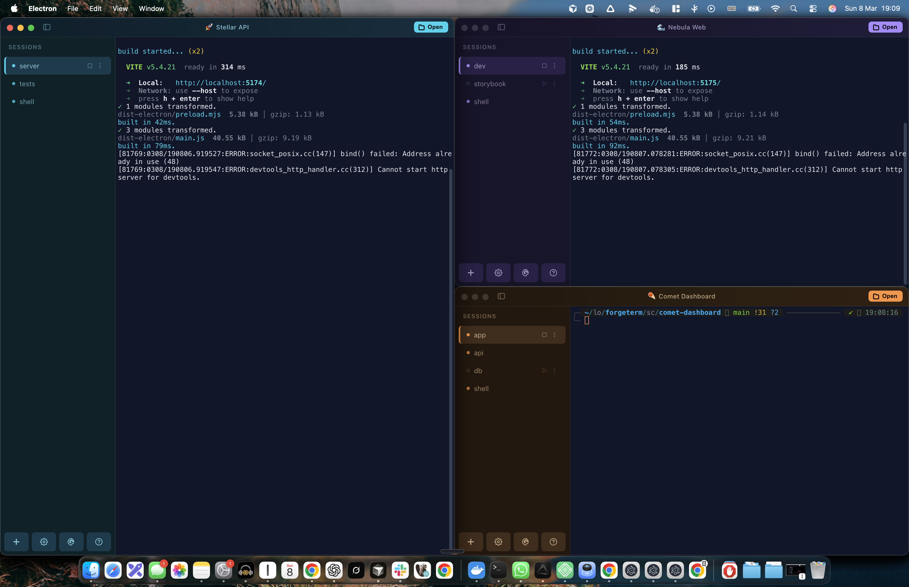
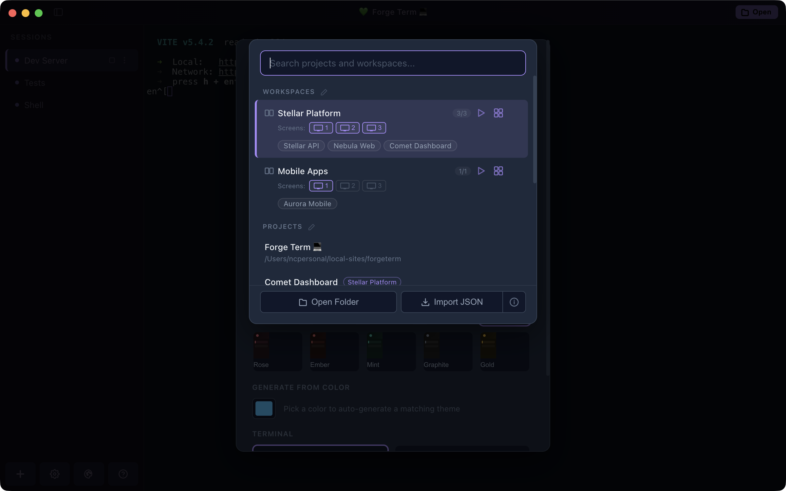
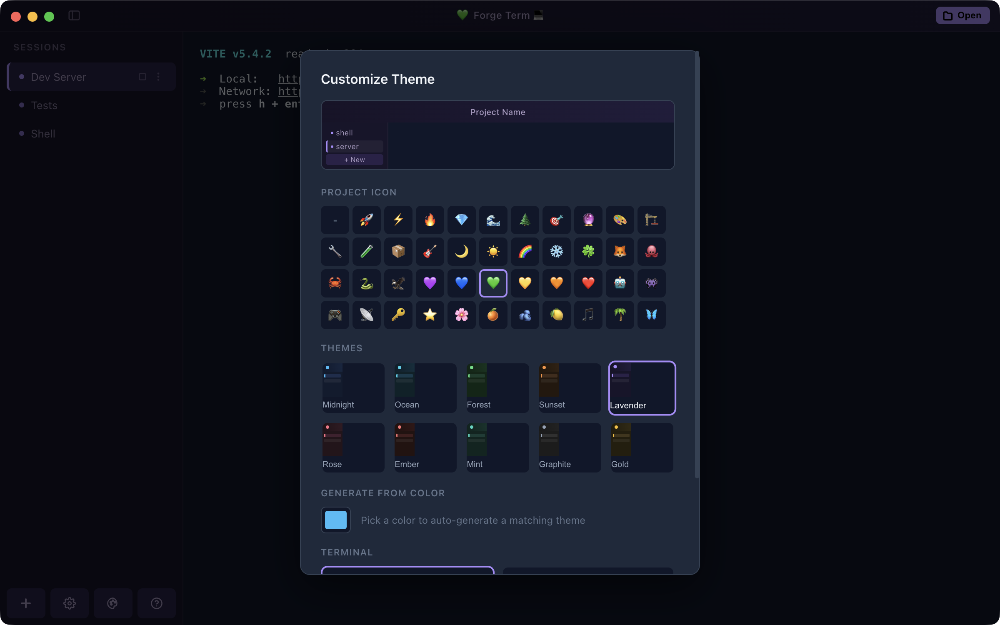
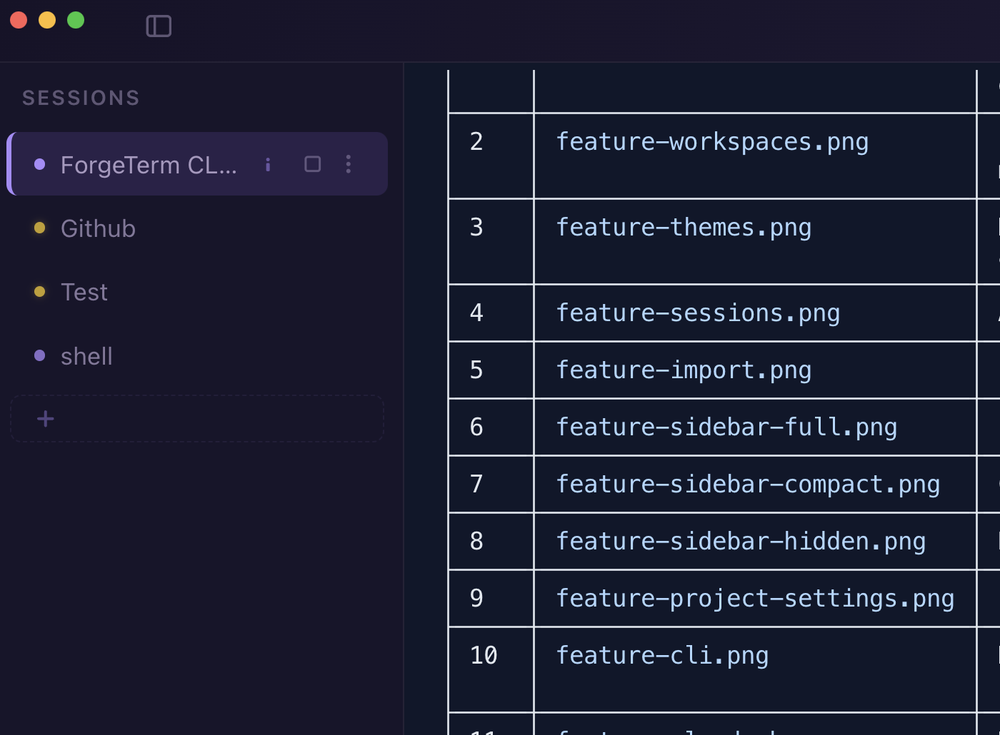
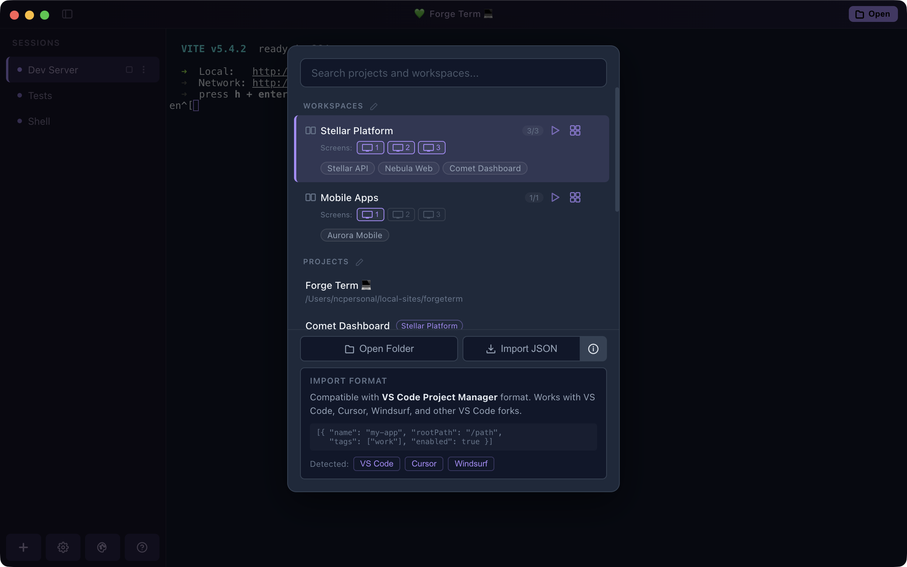

# ForgeTerm

A terminal emulator built for multi-project workflows. Open an entire workspace with one click - each project gets its own themed window with pre-configured terminal sessions, automatically tiled across your screen.



## Features

### Workspaces and Auto-Arrange

Group related projects into workspaces and open them all at once. ForgeTerm tiles windows automatically - side-by-side for two, master-detail for three, 2x2 grid for four, and so on up to six per screen. If you have multiple monitors, choose which display each workspace targets.



### Per-Project Theming

Every project gets its own color theme so you can tell windows apart at a glance. 10 built-in presets, a hex color generator, Peacock sync for VS Code users, and 43 project emojis.



### Automatic Sessions

Define named terminal sessions that auto-launch when you open a project. Dev server, test watcher, and shell - all running in one window without manual setup.



### Import from VS Code Project Manager

Already using the Project Manager extension? Import your projects and tags in one click. Works with VS Code, Cursor, Windsurf, and other forks. Tags with 2+ projects become workspaces automatically.



### Sidebar Modes

Cycle between full, compact, and hidden sidebar with Cmd+B. Full mode shows session names and controls. Compact shows dot indicators. Hidden gives you maximum terminal space.

### Per-Project Config

Drop a `.forgeterm.json` in any project to define startup sessions, themes, and window settings. The config travels with your repo.

```json
{
  "projectName": "My App",
  "sessions": [
    { "name": "Dev Server", "command": "pnpm dev", "autoStart": true },
    { "name": "Tests", "command": "pnpm test --watch" },
    { "name": "Shell" }
  ],
  "window": {
    "emoji": "🚀",
    "themeName": "ocean"
  }
}
```

## Download

**[Download ForgeTerm v0.2.0 for macOS (Apple Silicon)](https://github.com/codama-dev/forgeterm/releases/download/v0.2.0/ForgeTerm-Mac-0.2.0.dmg)**

See all releases on the [Releases page](https://github.com/codama-dev/forgeterm/releases).

> ForgeTerm currently ships as a macOS DMG for Apple Silicon. To run on Windows, Linux, or Intel Mac, clone the repo and build locally with `pnpm build` - electron-builder supports all platforms.

## Keyboard Shortcuts

| Shortcut | Action |
|---|---|
| Cmd+N / Cmd+T | New session |
| Cmd+1-9 | Switch to session |
| Cmd+K | Clear terminal |
| Cmd+P | Project switcher |
| Cmd+O | Open folder |
| Cmd+B | Toggle sidebar |
| Cmd+, | Project settings |
| Cmd+Shift+T | Theme editor |
| Cmd+Shift+= / - | Lighten / darken theme |
| Cmd+W | Close window |

## Build from Source

```bash
git clone https://github.com/codama-dev/forgeterm.git
cd forgeterm
pnpm install

# Dev mode
pnpm dev

# Package
pnpm build
```

## Architecture

Three-layer Electron app:

- **Main process** (`electron/`) - App lifecycle, window management, PTY sessions via node-pty
- **Preload bridge** (`electron/preload.ts`) - Typed IPC interface exposed as `window.forgeterm`
- **Renderer** (`src/`) - React + Zustand + xterm.js

## Tech Stack

- Electron
- React 18
- TypeScript
- xterm.js + node-pty
- Zustand
- Vite

## Contributing

ForgeTerm is open source and actively looking for contributors. Whether it's a bug fix, a new feature, better docs, or just a suggestion - all contributions are welcome.

- **Found a bug?** [Open an issue](https://github.com/codama-dev/forgeterm/issues) with steps to reproduce
- **Have an idea?** [Start a discussion](https://github.com/codama-dev/forgeterm/issues) or open a feature request
- **Want to contribute code?** Fork the repo, create a branch, and open a PR - no issue required for small fixes
- **Not a developer?** Testing, reporting bugs, and suggesting improvements are just as valuable

Check the [open issues](https://github.com/codama-dev/forgeterm/issues) for things to work on. Issues labeled `good first issue` are a great starting point.

## License

[MIT](LICENSE)
